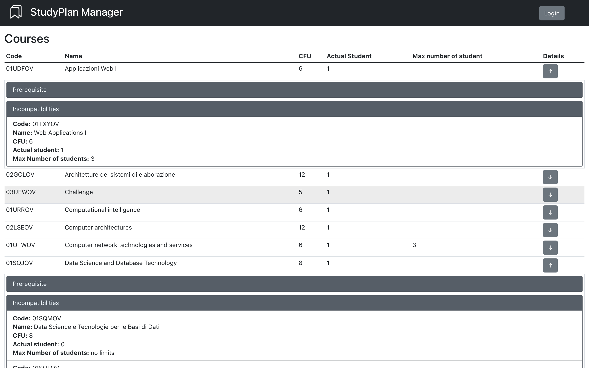
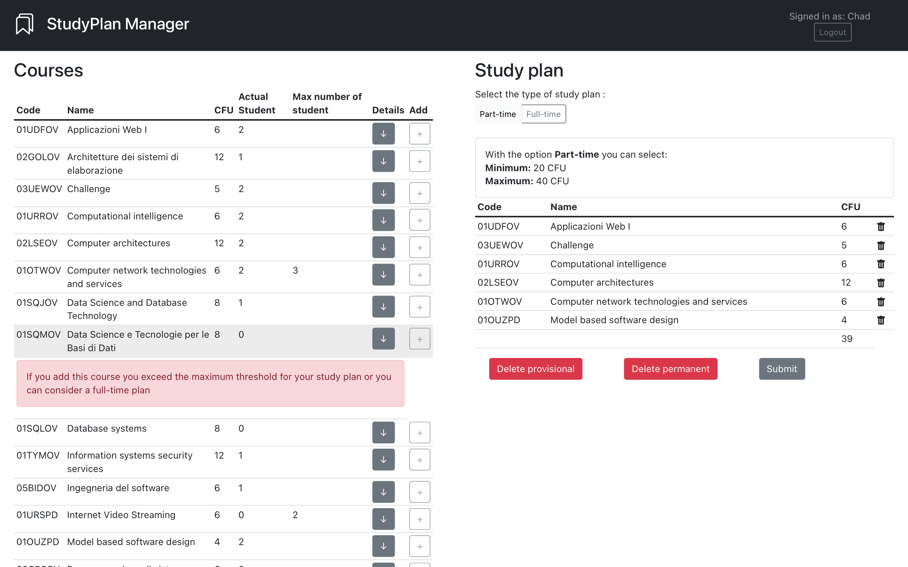

# React project
A simple web application written using React JS framework that manage a study plan  of a student with the management of prerequisites and incompatibilities. 

The backend is implemented with Node Express and with a simple example of the paradigm Router Service Dao

## React Client Application Routes

- Route `/`: contains also the homepage and the homepage logged-in. 
  
  In the first case the user see only the list of all available courses. In the second case, after the login the user see his study plan if exists (it can be modified) and the list of the courses.
If the study plan doesn't exists the user can create a new one.
- Route `/login`: contains the login form in which the user insert his credentials to access.

## API Server

### __Get sessions__

__URL:__ `/api/sessions/current`

__Method:__ GET

__Description:__ Retrieve the session of the user if is already logged, otherwise return an error message 

__Request body:__ _None_ or authenticated

__Response:__ `200 OK`

__Response body:__ 
```
        {
            id:1
            name: "John"
        }
```
__Error responses:__ `500 Internal server error` ,

 `401 Unauthorized`

 ### __Create a new session__

__URL:__ `/api/sessions`

__Method:__ POST

__Description:__ Create a new study session and retrive the user info if the login process is completed.  

__Request body:__ 
```
{
   "username":"chad.smith"
   "password" : "test"
}
```

__Response:__ `201 Created`

__Response body:__ 
```
        {
            id:1
            name: "John"
        }
```
__Error responses:__ `500 Internal server error`, 
 
 `401 Unauthorized`

  ### __Delete a session__

__URL:__ `/api/sessions/current`

__Method:__ DELETE

__Description:__ Delete a session for an authenticated user

__User body:__ `{id:1}`

__Response:__ `204 No Content`

__Response body:__  _None_

__Error responses:__ `500 Internal server error`,

`401 Unauthorized`


### __Get all courses__

__URL:__ `/api/courses`

__Method:__ GET

__Description:__ Retrieve the list of all the available courses. 

__Request body:__ _None_

__Response:__ `200 OK`

__Response body:__ 
```
    [
        {
            "code": 02GOLOV,
            "name": "Architetture dei Sistemi di Elaborazione",
            "cfu" : 10,
            "maxStud" : null,
            "proped" : null, 
            "numStud": 2 
        },
               {
            "code": 02LSEOV,
            "name": "Computer architectures",
            "cfu" : 12,
            "maxStud" : null,
            "proped" : null,
            "numStud" : 1
        }
      

    ]
    
```
__Error responses:__ `500 Internal server error` 
### __Get all incompatibilities__

__URL:__ `/api/courses/incompatibilities`

__Method:__ GET

__Description:__ Retrieve the list of all the incompatibilies between courses. 

__Request body:__ _None_

__Response:__ `200 OK`

__Response body:__ 
```
    [
                {
            "mainCode": 02GOLOV,
            "incompCode": 02LSEOV
        },
                {
            "mainCode": 02LSEOV,
            "incompCode": 02GOLOV
        },
                        {
            "mainCode": 01SQJOV,
            "incompCode": 01SQMOV
        }
                                {
            "mainCode": 01SQJOV,
            "incompCode": 01SQLOV
        }
      

    ]
    
```
__Error responses:__ `500 Internal server error` 

### __Get the study plan for the logged student__

__URL:__ `/api/studyplan`

__Method:__ GET

__Description:__ Retrieve the studyplan for the logged student. 

__Request body:__ _None_

__User body:__ `{id:1}`

__Response:__ `200 OK`

__Response body:__ 
```
    {
    "courses": [
        {
            "code": "01UDFOV",
            "name": "Applicazioni Web I",
            "cfu": 6,
            "maxStud": null,
            "proped": null
        },
        {
            "code": "03UEWOV",
            "name": "Challenge",
            "cfu": 5,
            "maxStud": null,
            "proped": null
        },
        {
            "code": "01URROV",
            "name": "Computational intelligence",
            "cfu": 6,
            "maxStud": null,
            "proped": null
        },
        {
            "code": "02LSEOV",
            "name": "Computer architectures",
            "cfu": 12,
            "maxStud": null,
            "proped": null
        },
        {
            "code": "01OTWOV",
            "name": "Computer network technologies and services",
            "cfu": 6,
            "maxStud": 3,
            "proped": null
        },
        {
            "code": "01OUZPD",
            "name": "Model based software design",
            "cfu": 4,
            "maxStud": null,
            "proped": null
        }
    ],
    "ptft": 1
}
```
__Error responses:__ `500 Internal server error`, 

`401 Unauthorized`

### __Create a new studyplan__

__URL:__ `/api/studyplan`

__Method:__ POST

__Description:__ Create a new study plan for the logged student, each previous version will be cancelled  

__Request body:__ 
```
{
   "courses": ["02GOLOV","01SQMOV","03UEWOV","01TXYOV"]
   "ptft" : 1
}
```
__User body:__ `{id:1}`

__Response:__ `201 Created`

__Response body:__ _None_

__Error responses:__ `500 Internal server error`,

 `422 Unprocessable Entity`, 
 
 `401 Unauthorized`

 ### __Delete a study plan__

__URL:__ `/api/studyplan/user/all`

__Method:__ DELETE

__Description:__ Delete a study plan permanently for the logged student

__Request body:__ _None_

__User body:__ `{id:1}`

__Response:__ `204 No Content`

__Response body:__  _None_

__Error responses:__ `500 Internal server error`,

`401 Unauthorized`
 
## Database Tables
A list of the database tables with an example for each row

**Table `Courses`**

| code  | name  |  cfu | maxStud  |  proped |
|---|---|---|---|---|
| 02GOLOV  | Architetture dei sistemi di elaborazione  |12  | null  |  null|

**Table `CoursesUsers`**
  
| code  |  iduser |
|---|---|
| 02GOLOV  | 1  |


**Table `Incomp`** 

| mainCode  |  incompCode |
|---|---|
| 02GOLOV  | 02LSEOV  |

**Table `Users`** 

| id  | name  |  surname |  username  | password  |  ptft |  salt |
|---|---|---|---|---|---|---|
|  1 | John  | Smith  | john.smith  | bf77052a4cf1925b67755662b6fbc68255ac709d535cf4f3ae7fd211d18425c7  | 1  | cidamcndoslcdvds  |
  

## Main React Components

- `Home` (in `components/Home.js`): contains the **main interface** in particular the `Courses` component and `Studyplan` component rendered only if the user is logged
- `Navbar` (in `components/Navbar.js`): contains the **navbar** of the entire application. From it the user can access to the `Login` route through a button if is not logged, otherwise he can do the log out (also through a button) and view his name.
- `Studyplan` (in `components/Studyplan.js`): contains the interface reserved to the managment of the study plan. From it the user can **view**, **create** or **modify** his study plan. In the interface is included the possibility to set a **part time** or **full time** studyplan, view the **cfu** of the actual study plan (both in edit mode or view mode) and the buttons that allow to **submit** the study plan, **delete the provisional study plan** or the **persistent one**.
This component appear only if the user is logged.
- `Courses` (in `components/CoursesComponent.js`): contains the interface that the user see also if he is not logged. This interface shows all the information related to a course including the **name**, **cfu**, the **maximum number of the students** that can join to the specific course and the **actual number of the students** signed up to the course. The user can view other informations about a course: the **prerequisite course** and the **incompatibilities** in a drop down menu. In edit mode this component shows the **add button** that allows to add a course to the provisional study plan if it's possible, otherwise show the reason.
- `LoginForm` (in `components/LoginComponents.js`): contains the **login** form that allow to insert the credentials of the user. If the credentials are not valid or are wrongs, it shows an alert with the specific error.
- `LogoutButton` (in `components/LoginComponents.js`): contains the **logout** button that allow to do the logout from the application.

## Screenshot
**Login** : login page.


**Homepage not logged** : homepage when a user is not logged.



**Homepage logged** : homepage when a user is logged and has already a study plan.


**Homepage logged** : homepage when a user is logged and doesn't have a study plan yet.


**Edit mode** : homepage in edit mode 


**Edit mode** : homepage in edit mode when an error occurs on the add




## Users Credentials

- **username:** john.smith | **password:** test | **study plan:** full time (0)
- **username:** jack.daniels | **password:** test | **study plan:** part time (1)
- **username:** jimmy.carrots | **password:** test | **study plan:** full time (0)
- **username:** chad.smith | **password:** test | **study plan:** part time (1)
- **username:** anthony.flead | **password:** test | **study plan:** part time (1)
- **username:** katy.chair | **password:** test | **study plan:** _empty_ (null)


